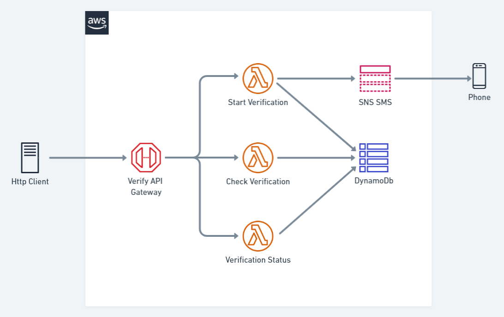

# Phone Verify API

This is an open source application designed to show the usage of modern serverless compute platforms such as [AWS Lambda](https://aws.amazon.com/lambda/) and [DynamoDB](https://aws.amazon.com/dynamodb/). It is built and deployed using the [AWS Cloud Development Kit](https://docs.aws.amazon.com/CDK/latest/userguide/what-is.html).

This is a service that can be used by an application to check that a user is the owner of the phone number they provide.

[Watch me build this application on YouTube](https://www.youtube.com/watch?v=c9UXHPX6-Ns&list=PLbuD6VMxPZScqUXKm2QAc_InCGdP6jKJy)

## Architecture



## API

### Start verification

When a user is validating their phone number, the service will send a 6 digit verification code by SMS and waits for their response.

*Start Request:*

`POST /verify/start`

```json
{ "Phone": "+64223062141" }
```

*Start Response:*

```json
{ "Id": "44c090cc-2ca0-491e-a4d0-dd2b2d4efadb" }
```

### Check verification

The service checks the users input matches the code. If they match it marks the phone number as verified.

*Check Request*

`POST /verify/check`

```json
{ "Id": "44c090cc-2ca0-491e-a4d0-dd2b2d4efadb", "Code": "654321" }
```

*Check Response:*

```json
{ "Verified": true }
```

### Verification Status

Use this endpoint to check the status of a verification.

*Status Request*

`POST /verify/status`

```json
{ "Id": "44c090cc-2ca0-491e-a4d0-dd2b2d4efadb" }
```

*Status Response:*

```json
{ "Verified": true }
```

### Errors

Errors will be returned with a 400 status code and a simple error message.

```json
{ "Error": "Phone required" }
```

--------------

### Rate limiting

Start Verification

* The top is 10 every half an hour, per phone number.

Check Verification

* The top is 5 every day, per phone number.

Verification Status

* The top is 60 per minute, per phone number.
* The top is 180 per hour, per phone number.
* The top is 250 per day, per phone number.
